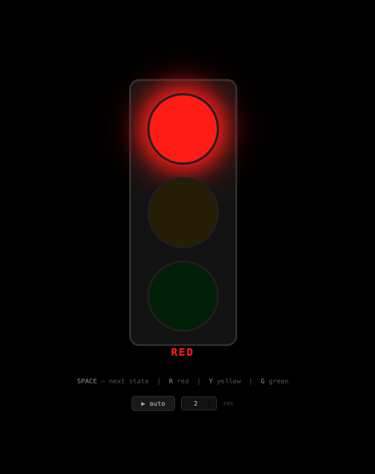

# Traffic Light — Django App

A minimal Django traffic light simulator built for PuzzleBot camera testing. Black background, keyboard-driven, and accessible over the local network from any device.



---

## Requirements

- Python 3.8+
- Django 4.x

```bash
pip install django
```

---

## Run

```bash
# Local only
python3 manage.py runserver

# Accessible over your local network (phone, camera, etc.)
python3 manage.py runserver 0.0.0.0:8000
```

Then open in any browser:

```
http://<your-machine-ip>:8000
```

> Find your IP with `ipconfig getifaddr en0` (macOS) or `hostname -I` (Linux).

---

## Controls

| Key / Action | Effect |
|---|---|
| `Space` | Cycle to next state |
| `R` | Jump to **Red** |
| `G` | Jump to **Green** |
| `Y` | Jump to **Yellow** |
| **▶ auto** button | Start/stop automatic timer |
| Seconds input | Set how long each state lasts |

## State Cycle

```
Red → Green → Yellow → Red → ...
```

---

## Project Structure

```
trafffic/
├── core/           # Django project settings & URLs
├── light/          # Traffic light app
│   ├── templates/light/index.html   # All UI + JS logic
│   ├── views.py
│   └── urls.py
└── manage.py
```

---

*Generated with the assistance of Claude Sonnet 4.5, Anthropic, May 2026.*
